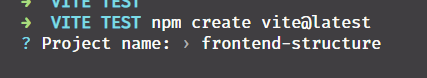
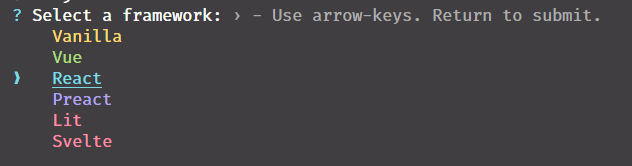
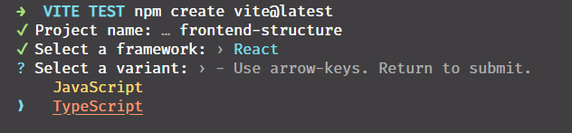

# [🏠 BACK TO HOME PAGE ➡️](../readme.md)

- [🏠 BACK TO HOME PAGE ➡️](#-back-to-home-page-️)
  - [creating the react app with vite](#creating-the-react-app-with-vite)

## creating the react app with vite

type this command to create a vite app

```bash
🔥 -> npm create vite@latest
```

will use these configuration options when creating the app.

- type a project name



- select a frame work (react)



- select typescript
  


final output

```bash
🔥-> npm create vite@latest
✅ Project name: … frontend-structure
✅ Select a framework: › React
✅ Select a variant: › TypeScript

Scaffolding project in /mnt/c/Users/Chamara/Documents/code/2022/VITE TEST/frontend-structure...
```

Now run:

```bash
🔥 -> cd frontend-structure
🔥 -> npm install
🔥 -> npm run dev
```

we can use these commands to run the application

```json
{
  "scripts": {
    "dev": "vite", // start dev server, aliases: `vite dev`, `vite serve`
    "build": "vite build", // build for production
    "preview": "vite preview" // locally preview production build
  }
}

```
and install type definitions for node 

```bash
npm i -D @types/node
```